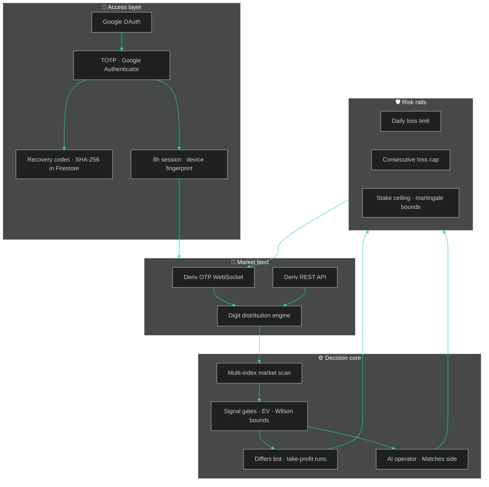
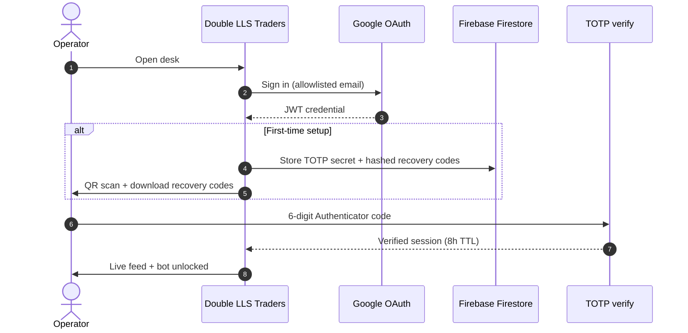
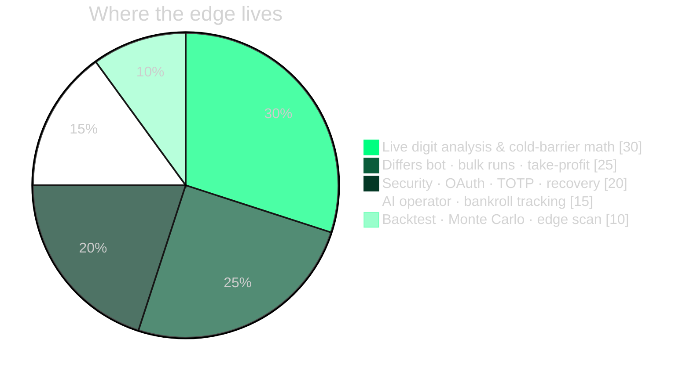

<div align="center">


# Double LLS Traders

**Institutional-grade Deriv Matches / Differs trading desk**

[](https://github.com/DoubleLLSTraders/double-lls-traders)
[](./package.json)
[](https://developers.deriv.com/)
[](./SECURITY.md)

Live digit analysis · automated Differs engine · AI operator · hardened risk rails · operator-only access

**[Launch desk →](https://doublellstraders.github.io/double-lls-traders/)** · **[Repository →](https://github.com/DoubleLLSTraders/double-lls-traders)** *(private)*

<br />


<br />

<sub>Designed & built by <strong>Joseph Nyarandi</strong></sub><br />
<sub><em>Double LLS Traders · precision over noise</em></sub>

</div>

---

## What this is

**Double LLS Traders** is a secured, browser-native command center for **Deriv synthetic indices** — built around **Matches** and **Differs** digit contracts. It ingests live ticks over the Options API, runs multi-window statistical gates, executes paper or live bot cycles, and wraps the entire surface in **Google OAuth + Google Authenticator (TOTP)** before a single candle loads.

This is not a toy dashboard. It is a **closed operator platform**: allowlisted identities, hashed recovery codes, session binding, daily loss caps, consecutive-loss brakes, and take-profit run logic — the kind of stack you expect on a prop desk, implemented as a modern SPA.

---

## Brand palette

| Swatch | Hex | Role |
|:------:|:---:|:-----|
|  | `#000000` | Void black — primary canvas |
|  | `#00ff80` | Neon signal — accent, cold digits, live edge |
|  | `#ffffff` | Pure white — typography & LLS monogram |
|  | `#043825` | Deep forest — panels & depth |
|  | `#0a5c3a` | Mid green — borders & secondary chrome |

Logo assets: [`logo-exports/`](./logo-exports/) · [`public/`](./public/) · [`src/assets/`](./src/assets/)

---

## Platform architecture



---

## Access flow

Only authorized operators pass the gate. Everyone else sees nothing.



---

## Capability map



| Module | Depth |
|--------|-------|
| **Live feed** | Deriv Options API — OTP WebSocket + REST, real-time digit strips & tick chart |
| **Market scan** | Auto-ranks volatility indices; picks the best Differs payout surface |
| **Signal engine** | Multi-window votes, Wilson bounds, cold-gap timing, EV cushion vs break-even |
| **Differs bot** | Take-profit runs, bulk contracts, martingale recovery, deep-next gate |
| **AI operator** | Matches-side automation with bankroll discipline |
| **Backtester** | Offline tick replay + Monte Carlo stress paths |
| **Access gate** | Google identity → TOTP → session → lockout on brute force |

---

## Security stack

| Layer | Protection |
|--------|------------|
| **Identity** | Google OAuth — allowlisted emails only |
| **2FA** | Google Authenticator (TOTP, 30s window) |
| **Recovery** | 8 cryptographically random one-time codes (SHA-256 hashed in Firestore) |
| **Session** | 8-hour TTL, browser fingerprint binding, random session token |
| **Brute force** | 5 failed attempts → 15-minute lockout (per device) |
| **Secrets** | `.env` gitignored; never commit PATs or OAuth client secrets |
| **Firestore** | Rules scoped to `totp_secrets/{email}` for authorized operators only |

Full operator checklist → **[SECURITY.md](./SECURITY.md)**

---

## Quick start (local)

### 1 · Prerequisites

| Service | What you need |
|---------|----------------|
| **Deriv** | [Developer dashboard](https://developers.deriv.com/dashboard/) app ID (0% markup, Trade scope) |
| **Demo PAT** | [home.deriv.com → API tokens](https://home.deriv.com/dashboard/profile/api-tokens) with Trade scope |
| **Google OAuth** | Web client ID — see origins below |
| **Firebase** | Firestore enabled; publish [`firestore.rules`](./firestore.rules) |

**Google OAuth — Authorized JavaScript origins** *(no path)*

```
http://localhost:5173
https://doublellstraders.github.io
```

**Google OAuth — Authorized redirect URIs**

```
http://localhost:5173
https://doublellstraders.github.io/double-lls-traders/
```

### 2 · Configure

```bash
cp .env.example .env
# fill VITE_DERIV_*, VITE_GOOGLE_CLIENT_ID, VITE_FIREBASE_*
npm install
npm run check-auth
npm run dev
```

Open **http://localhost:5173/**

First login: **Google → scan Authenticator QR → download recovery codes → enter 6-digit code.**

---

## Deploy (GitHub Pages)

Workflow: [`.github/workflows/deploy-pages.yml`](./.github/workflows/deploy-pages.yml) — runs on push to `master`.

Add **Actions secrets** mirroring `.env`:

| Secret | Required |
|--------|----------|
| `VITE_DERIV_APP_ID` | yes |
| `VITE_DERIV_TOKEN_DEMO` | yes |
| `VITE_DERIV_DEMO_ACCOUNT_ID` | recommended |
| `VITE_GOOGLE_CLIENT_ID` | yes |
| `VITE_FIREBASE_*` | yes (all Firebase web config vars) |
| `VITE_TRADING_MODE` | `live` or `paper` |

**Live URL:** https://doublellstraders.github.io/double-lls-traders/

---

## Operator scripts

```bash
npm run dev          # local desk
npm run build        # production bundle (Pages: GITHUB_PAGES=true npm run build)
npm run check-auth   # verify Deriv PAT + demo account
npm run backtest     # offline strategy replay
npm run find-edge    # scan indices for payout edge
npm run run-bot      # headless bot cycle (CLI)
```

---

## Safety defaults

- Demo account + **paper mode** for all development.
- Session caps: daily loss, consecutive losses, max stake — all in `.env`.
- **Never** paste tokens, recovery codes, or `.env` in chat or screenshots.
- Rotate Deriv PAT and recovery codes if exposure is suspected.

---

## Credits

<table>
<tr>
<td width="80"></td>
<td>

**Joseph Nyarandi** — architect & builder  
*Double LLS Traders* — institutional-grade digit desk for Deriv synthetic indices  

</td>
</tr>
</table>

---

## Disclaimer

For analysis and education only. **Not financial advice.** Synthetic index digits are uniformly random over time; no strategy guarantees profit. Trade only with funds you can afford to lose.
